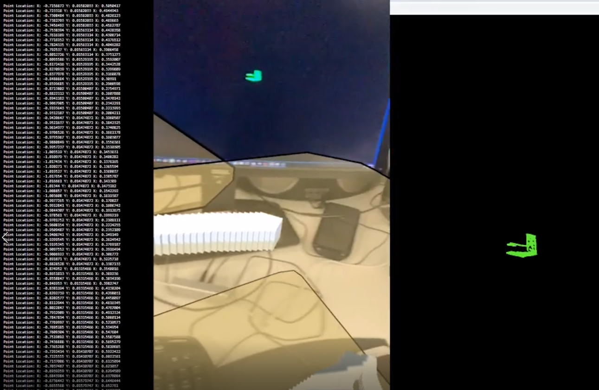

# ARScanner
## Scan with AR IOS app and watch it build in the browser

### Demo video
[](https://youtu.be/SFiMAUrC4lY)


### Setup

```
- Terminal navigate to ServerAndBrowser/
- Run these commands:

> npm install
> node main.js
this will start the server with a localtunnel url and host the website.
You may access the site locally with: 
> localhost:3000 or https://roxyrypler.localtunnel.me

```
### Building to IOS

```
open the unity project located in Unityprojects/ARScanner/

From there you can build to IOS

```

### Running the test

```
run the unity project located in UnityProjects/InitialTestNotAR/loggingdata/

```

### Technology used in this project

```
> Unity
> C# Unity API
> ARKit
> ARFoundation
> Node.js
> Express.js
> Socket.io
> Localtunnel.me NPM module
> Three.js
> html
> css
> javascript
```